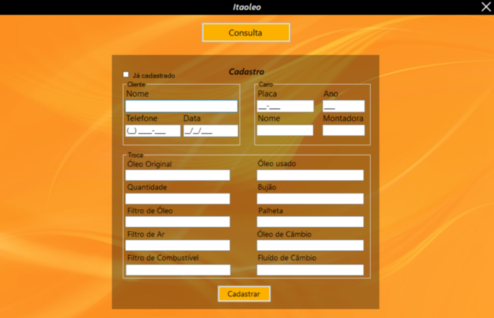
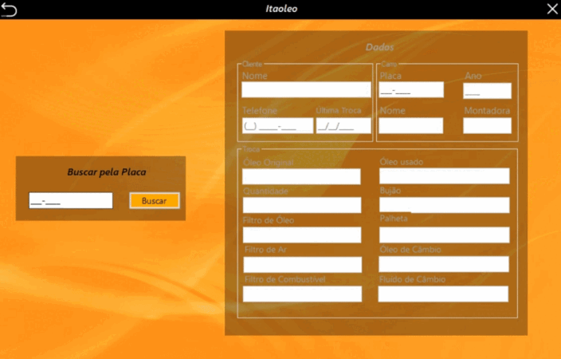

# Cadastro - WinForms
Esse projeto eu desenvolvi em C# utilizando Windows Forms, que oferece uma solução completa para o cadastro e consulta de clientes. O aplicativo é projetado para facilitar o gerenciamento de informações do cliente e armazená-las em uma planilha do Excel.

## Como usar
Para usar o programa, siga estas etapas:

1. Abra o projeto no Visual Studio.
2. Execute o programa.
3. Na tela de cadastro, insira as informações do cliente e do carro.
4. Após preencher, clique no botão "Cadastrar" para cadastrar um novo cliente.

Para consultar um cliente, faça o seguinte:

1. Na tela principal, clique no botão "Consultar".
2. Na tela de consulta, insira a placa do carro do cliente que deseja consultar.
3. Clique no botão "Buscar" para exibir as informações do cliente.

## Tecnologias utilizadas nesse projeto
C#

WinForms

OpenXML

## Tela de Cadastro

## Tela de Consulta

